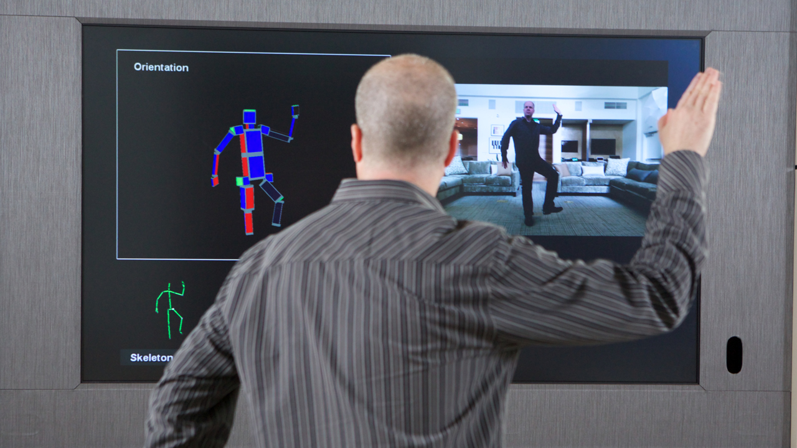

## Proposition de sujet pour le travail de fin d'année
Je vais proposer ici quelques idées que j'ai envie de traiter pour ce travail.

### Les manettes de consoles de jeux

 avec des supports spécialement penser pour optimiser ces technologies.

Pour aller plus loin :
[Article : Nintendo prépare déjà l'avenir avec une nouvelle manette](https://www.begeek.fr/nintendo-prepare-deja-lavenir-avec-une-nouvelle-manette-321782)
[

### La détection de mouvements

Je me suis toutjours demandé comment les appareils détectaient les mouvements. Je sais, par exemple, que la console Kinect projette des infra-rouges et reconstitue un squelette à partir des informations receuillies. Néanmoins, le procèder de la Kinect est assez lourd, il y a surement des moyens plus simple ou plus efficace. C'est ces moyens que j'aimerais trouver et expliquer.
